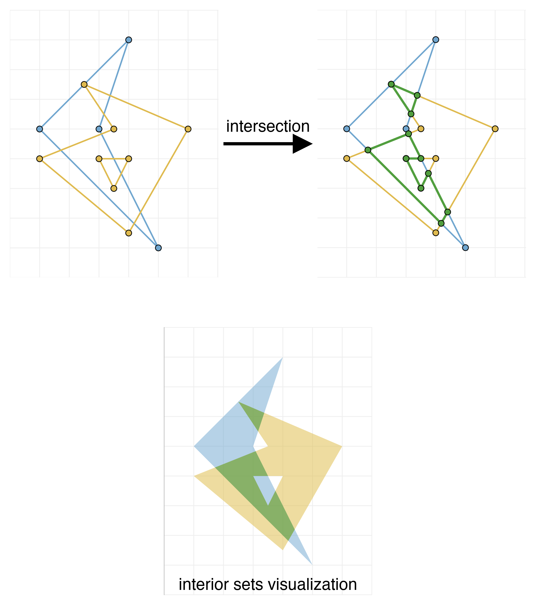
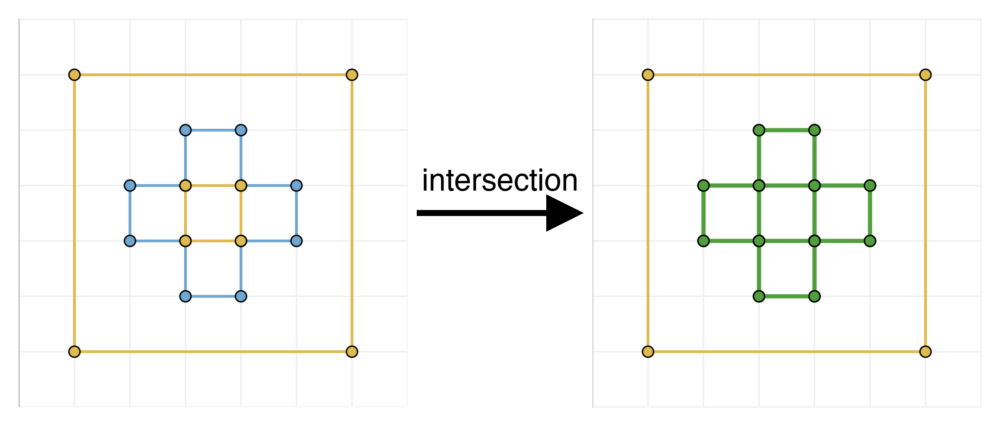

# Formally verified multipolygon intersection

To my knowledge, this is the first formally verified implementation of an intersection algorithm for polygons. (Also compare with [Related work](#related-work))

The experience of working with AI agents on this project changed a lot with recent model releases. Latest models are able to provide algorithm implementation with formal proof in one shot, whereas previous models required me to provide proof strategies in multiple steps. ([Capabilities of AI agents](#capabilities-of-ai-agents))

Trust in the correctness comes entirely from the Lean checker and human review of a small specification, not from the LLM. (See [Use of AI agents](#use-of-ai-agents))

## Try it out

Try out the [web demo](https://schildep.github.io/verified-polygon-intersection/) built around the verified core, where you can draw and intersect multipolygons.

## Background

Multipolygon intersection is a standard feature of many vector graphic editors.

A multipolygon is defined by a list of polygon components and polygonal holes, each defined by a list of vertices. It describes a two-dimensional area: the set of interior points. This set can be formally defined by [counting the parity](https://en.wikipedia.org/wiki/Point_in_polygon) of the number of intersections of the polygon with rays cast from each point on the plane. Given two multipolygons, we construct a new multipolygon, whose interior set is the intersection of the two interior sets of the input multipolygons.



There are infinitely many configurations of input polygons, so without formal verification no property can be exhaustively verified for every configuration by classical testing. Furthermore, for each polygon the set of interior points is infinite, so without formal verification interior sets and their intersection are just an interpretation that cannot be represented in the code.

In this development the intersection specification is formally described and fully verified with the Lean 4 proof assistant. So we can guarantee that these infinite sets of interior points actually satisfy the intersection equality, for any configuration of input polygons.

Implementations of computational geometry algorithms like this are notoriously hard to verify by classical testing, because of rare special configurations of inputs that may make up much of the complexity of the algorithm. Consider for example the following example where we intersect a cross (blue polygon in picture below) with a square with a hole (yellow polygons in the picture). To produce a multipolygon that describes the intersection, the algorithm must choose closed boundary components and order the vertices. This choice of which green segments belong together is not unique in this case (for example it could be 4 squares or a cross with a square hole), but it would be unique if the yellow hole were a tiny bit smaller or larger. It is a non-trivial fact (related to Eulerian cycles) that it is possible to partition and order the segments into closed boundary components in all cases.



The length of the formal verification in this repository mostly does not come from the algorithm, but from the fact that many seemingly obvious geometrical facts have no short rigorous proof. Only the proof that definition of "inside" described above is independent from the direction of the ray took thousands of lines of lean.

## Use of AI agents

The setup of this repository aims to minimize human review needed to verify correctness of the implementation of the polygon intersection algorithm. A human reviewer just needs to read the 3 files [`DataStructures.lean`](Polygons/DataStructures.lean), [`Defs.lean`](Polygons/Defs.lean) and [`MultipolygonIntersectionAlgorithmWithPreconditionCheck.lean`](Polygons/MultipolygonIntersectionAlgorithmWithPreconditionCheck.lean) and run the Lean checker. These are 87 lines of simple-to-understand Lean specification, mostly setting up basic geometrical definitions for polygons. The unoptimized code implementing the algorithm is already more than twice that and more complicated to understand. The code will grow a lot once we add optimizations. The specification that humans have to read to review correctness, on the other hand, will stay the same size.

It is not necessary to read other files to review correctness. I also read and directed the content of other files that don't end in `...Proofs.lean` and `...Impl.lean` to steer the strategy (pre Opus 4.8, see [Capabilities of AI agents](#capabilities-of-ai-agents)). The main theorems in these other files served as checkpoints, so I could use the Lean checker to determine when the agent actually succeeded at a task.
The implementation and formal proof of its correctness in the `...Proofs.lean` and `...Impl.lean` files was autonomously written by AI agents and never reviewed by me or any other human, but thanks to the Lean checker, neither I nor any human reviewer needs to trust any LLM in this process.

The way this separation is structured is described in [`CLAUDE.md`](CLAUDE.md) and may not be Lean-idiomatic.

A drawback I observed from forcing AI agents to formally verify their implementation is that this tends to produce code that is slower or disregards other practical considerations that are not captured in the specification. This probably stems from the difficulty of the formal verification pushing for simpler code and from the lack of formally verified practical software in the training data.

### Capabilities of AI agents

The experience of working with AI agents on this project changed a lot with recent model releases:

My first attempt at this project was at the beginning of the year, using Claude Opus 4.5 and 4.6. In my experience Opus 4.5 was the first model that could handle non-trivial lean proofs. But it was at the level, that only when I was able to sketch out a perfectly rigorous proof, it would translate it to Lean. For example I needed to split the proof that the definition of the interior set using the ray intersection is independent of the ray directions, into many small steps. I was then stuck at this project until Claude Opus 4.7 came out.

Claude Opus 4.7 enabled to take larger steps. It could prove that for every two polygons, there exists an intersection, but I still needed to provide the idea to use Eulerian circuits and in separate steps give it hints how to handle some tricky special cases. And from this theorem it was then able to autonomously extract a formally verified algorithm.

The day after the release, I tried Claude Opus 4.8 in ultracode mode. I started two sessions in parallel:
- One to reprove the main polygon intersection theorem, which is almost all of the previously done work, from scratch with no hints (in an isolated container to avoid peeking at the solution). See [github.com/schildep/challenge-verified-polygon-intersection-Opus-4.8](https://github.com/schildep/challenge-verified-polygon-intersection-Opus-4.8).
- Another to extend the algorithm to handle special cases regarding overlapping segments, where previous Opus 4.7 sessions failed. To my surprise, both of these sessions succeeded after a few hours of autonomous work.

It was able to formulate and execute large proof strategies. One thing that I observed from looking at the intermediate output of Opus 4.8, is that it actually seems to much more accurately handle the risk of wrong intermediate theorems: To prove a large theorem you have to take risk of loosing time trying to prove helper theorems that a priori might be incorrect. Where previous models got stuck at trying to prove an incorrect intermediate theorem, Opus 4.8 became suspicious, and autonomously pivoted to a different strategy or at another occasion it decided to run parallel subagents to try multiple strategies.


# Building and checking

Requires [elan](https://github.com/leanprover/elan). The Lean version is pinned in [`lean-toolchain`](lean-toolchain) (currently `leanprover/lean4:v4.15.0`) to simplify the WebAssembly build.

Check all proofs:

```
lake build
```

Inspect the axioms the theorems of interest depend on (e.g. here correctness theorem of the algorithm). This is important since agents could have introduced unwanted axioms into the proofs. We only depend on trusted axioms `[propext, Classical.choice, Quot.sound]`.

```
printf 'import Polygons.MultipolygonIntersectionAlgorithmWithPreconditionCheck\n#print axioms multipolygonIntersectionAlgorithmWithPreconditionCheck_interior_eq\n#print axioms multipolygonIntersectionAlgorithmWithPreconditionCheck_complete\n' | lake env lean --stdin
```

Build the WebAssembly bundle served by the web app (requires `emscripten`, `zstd`, `wasm-opt`):

```
./build.sh
```

# Next steps

- Measure and improve the performance of the implementation
- Simplify proofs, that take unnecessary detours, using latest models (as described in [Capabilities of AI agents](#capabilities-of-ai-agents), the current development contains many detours that can be avoided as we saw in [github.com/schildep/challenge-verified-polygon-intersection-Opus-4.8](https://github.com/schildep/challenge-verified-polygon-intersection-Opus-4.8))
- SVG import/export

# Related work

[Di Vito and Hocking (NASA Formal Methods 2021)](https://doi.org/10.1007/978-3-030-76384-8_6) verified a polygon *merge* algorithm in PVS, combining two overlapping simple polygons, computing a single outer boundary without holes.

